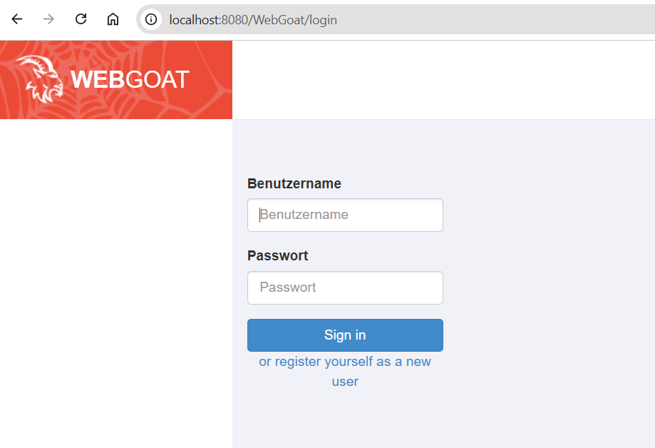

### Exercise 1: Setup WebGoat on AWS
###  Prerequisite
1. You have a running AWS EC2 instance.
2. You have pulled the docker image ```webgoat/webgoat```

### Task - Start WebGoat on AWS EC2 Instance
In your AWS EC2 Instance
1. Access your AWS EC2 Instance with Secure Shell
```
ssh -i <your-private-key> \
-L 8080:localhost:8080 \
-L 9090:localhost:9090 \
ubuntu@<your-aws-ec2-domain>
```
2. Check if the image ```webgoat/webgoat``` is pulled. Else pull it with docker pull
3. Start image
```
docker run -it \
--name webgoat \
-p 127.0.0.1:8080:8080 \
-p 127.0.0.1:9090:9090 \
-e WEBGOAT_HOST=webgoat.test \
-e WEBWOLF_HOST=webwolf.test \
-e TZ=Europe/Zurich webgoat/webgoat
```
4. Open your browser and paste the url
```
http://localhost:8080/WebGoat/
```
A login-page should appear:

[](img/webgoat-login.png)


