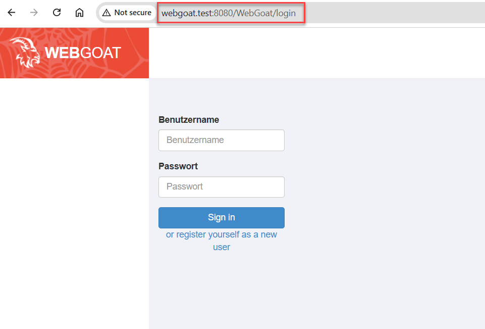

### Exercise 2: Setup WebGoat
###  Prerequisite
1. You have a running AWS EC2 instance.
2. Container ```webgoat/webgoat``` is running on AWS EC2 instance.

### Task - Adjust Network settings in Desktop system
In order to use OWASP ZAP (or another proxy), you can no longer use 
127.0.0.1 or localhost. You need custom host names.

Hosts file in
Windows: C:\Windows\System32\drivers\etc\hosts 
MacOSX: /etc/hosts

On your Desktop system ...

1. Backup your hosts file (i.e. hosts to hosts.ori)
2. Edit hosts file and add the following entry
```
127.0.0.1 webgoat.test
127.0.0.1 webwolf.test
```
Don't use .local!
3. Flush DNS settings
On Windows only in CMD (and not bash) shell
```
ipconfig /flushdns
```
On MacOSX: research the answer. Feel free to forward your results to me.

4. Ping the hostname
On Windows only in CMD (and not bash) shell
```
ping webgoat.test

Pinging webgoat.test [127.0.0.1] with 32 bytes of data:
Reply from 127.0.0.1: bytes=32 time<1ms TTL=128
Reply from 127.0.0.1: bytes=32 time<1ms TTL=128
Reply from 127.0.0.1: bytes=32 time<1ms TTL=128
Reply from 127.0.0.1: bytes=32 time<1ms TTL=128

Ping statistics for 127.0.0.1:
    Packets: Sent = 4, Received = 4, Lost = 0 (0% loss),
Approximate round trip times in milli-seconds:
    Minimum = 0ms, Maximum = 0ms, Average = 0ms
```

5. Open your browser and paste the url
```bash
http://webgoat.test:8080/WebGoat/
or 
http://webwolf.test:9090/WebWolf/
```
A login-page should appear:

[](img/webgoat-login-2.png)


