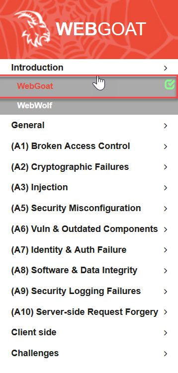
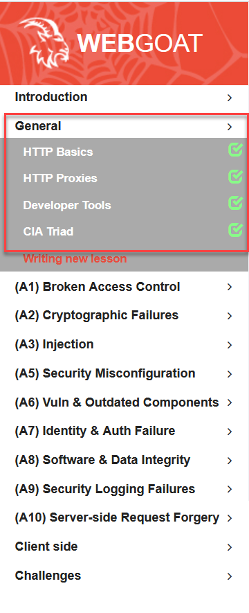
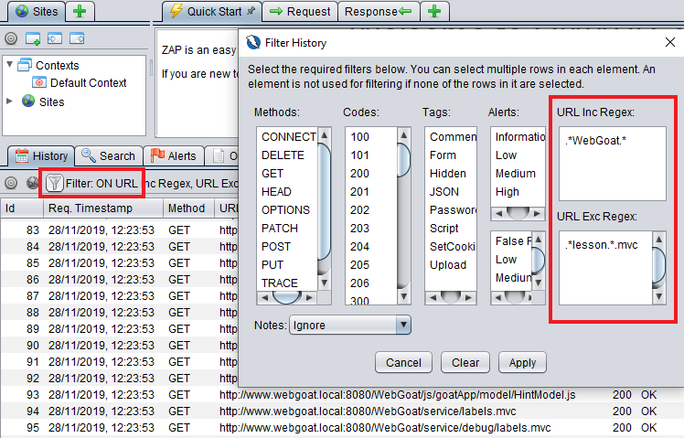

### Exercise 4: Your first challenges  
###  Prerequisite
1. You have ZAP Proxy installed on your Desktop

### Tasks: Start WebGoat with Zap 
1. Set the proxy in Zap under menu "Options" (see https://youtu.be/G9U1DmWZvXY)
2. Start WebGoat with Zap (see https://youtu.be/VN1WgMCZNmc)

### Task 1: Introduction

[](Introduction)

1. Read the introduction of WebGoat
2. Skip the part with WebWolf

### Task 2: General challenges

1. Solve challenges under category "General". 
2. Skip the part with "Writing new lessons"

[](img/wg-intro.png)


### Remark: Filter requests in history panel
[](img/zap-exclude.png)

Then in the _URL Inc Regex_ box type:
```
.*WebGoat.*
```
And in the _URL Exc Regex_ box type:
```
.*lesson.*.mvc.*
```
Click 'Apply to close the window, and ZAP will now no longer show internal WebGoat requests.
