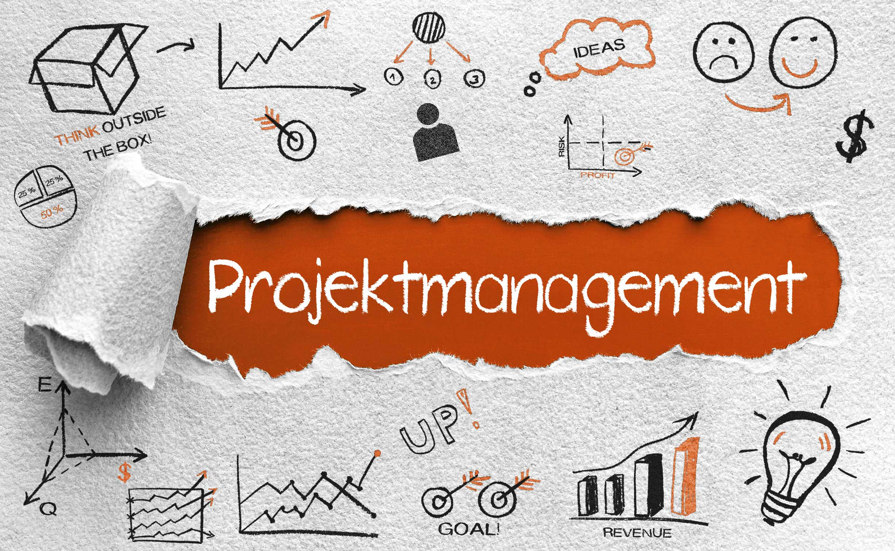

# Projektmanagement (Projektmerkmale)

## Aufgabe 1: Projekt oder Tagesgeschäft?

**Szenario**

Die Firma TechPrint produziert täglich Druckerpatronen.
Der Geschäftsführer möchte zusätzlich einen **Online-Shop entwickeln**, über den Kunden direkt bestellen können. Dafür wird ein Team aus IT, Marketing und Vertrieb gebildet. Das Projekt soll innerhalb von **8 Monaten** umgesetzt werden.

**Fragen**

a) Handelt es sich um ein Projekt oder um Tagesgeschäft?

b) Nennen Sie **mindestens drei Argumente**, die im Szenario erfüllt sind.

### Lösung

a)
Es handelt sich um **ein Projekt**.

b) Typische Projektmerkmale:

* **Einmaligkeit** → Der Online-Shop wird einmal entwickelt
* **Zeitliche Begrenzung** → 8 Monate Laufzeit
* **Klare Zielsetzung** → Entwicklung eines Online-Shops
* **Interdisziplinäres Team** → IT, Marketing und Vertrieb arbeiten zusammen

---

## Aufgabe 2: Projektmerkmale erkennen

**Szenario**

Ein Unternehmen möchte ein **neues ERP-System** einführen.
Dafür wird ein Projektteam gebildet. Das Budget beträgt **250'000 CHF**. Die Einführung soll innerhalb eines Jahres erfolgen.

**Fragen**

a) Welche **vier typischen Projektmerkmale** sind im Szenario erkennbar?
b) Erklären Sie kurz jedes Merkmal anhand des Beispiels.

### Lösung

**Projektmerkmale**

1. **Klare Zielsetzung**
   → Einführung eines neuen ERP-Systems

2. **Zeitliche Begrenzung**
   → Umsetzung innerhalb eines Jahres

3. **Begrenzte Ressourcen**
   → Budget von 250'000 CHF

4. **Einmaligkeit / Neuartigkeit**
   → Die Systemeinführung ist kein alltäglicher Prozess

---

## Aufgabe 3: Projektgrösse bestimmen

**Szenario**

Ein Unternehmen möchte seine Firmenwebseite modernisieren.
Daran arbeiten:

* 2 Webdesigner
* 1 Marketingmitarbeiter
* Dauer: 6 Wochen
* Budget: 12'000 CHF

**Fragen**

a) Wie würden Sie dieses Projekt bezüglich **Grösse** einordnen?
b) Begründen Sie Ihre Entscheidung.

### Lösung

a)
Es handelt sich um ein **kleines Projekt**.

b) Begründung:

* Kurze Projektdauer
* Wenige beteiligte Personen
* Kleines Budget
* Geringe organisatorische Komplexität

---

## Aufgabe 4: Zielkonflikt im Projekt

**Szenario**

Ein Projektteam entwickelt eine neue App. Während der Entwicklung verlangt der Kunde zusätzliche Funktionen.

Dadurch entstehen folgende Probleme:

* Mehr Zeit wird benötigt
* Höhere Kosten entstehen
* Der ursprüngliche Termin kann nicht eingehalten werden

**Fragen**

a) Welche **Projektziele geraten hier in Konflikt?**
b) Warum ist dieser Zielkonflikt typisch für Projekte?

### Lösung

a) Konflikt zwischen:

* **Zeit**
* **Kosten**

b)
Wenn sich eines der Ziele verändert (z.B. mehr Funktionen), müssen meist auch **Zeit oder Kosten angepasst werden**.

---

## Aufgabe 5: Abgrenzung Projekt vs. Prozess

**Szenario**

In einem Unternehmen werden täglich Rechnungen erstellt und verschickt. Dieser Ablauf ist klar definiert und wiederholt sich jeden Tag gleich.

**Fragen**

a) Handelt es sich um ein Projekt oder einen Geschäftsprozess?
b) Begründen Sie Ihre Antwort.

### Lösung

a)
Es handelt sich um **Tagesgeschäft / Geschäftsprozess**.

b) Begründung:

* Wiederkehrende Tätigkeit
* Kein einmaliges Ziel
* Keine zeitliche Begrenzung
* Standardisierte Abläufe

