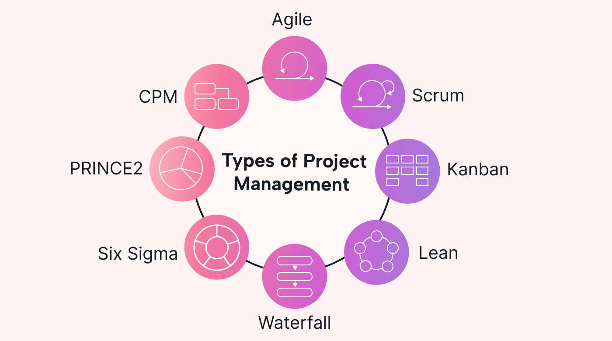

# Projektmanagement-Methoden

## **Aufgabe 1: Wahl des Vorgehensmodells**

Ein Unternehmen möchte eine neue interne Software entwickeln. Die Anforderungen sind zu Projektbeginn noch unklar und werden sich im Verlauf ändern. Welches Vorgehensmodell ist am besten geeignet und warum?

### **Lösung:**

Ein **agiles Vorgehensmodell (z. B. Scrum)** ist am besten geeignet.
**Begründung:**

* Anforderungen sind zu Beginn **nicht vollständig bekannt**
* Agile Modelle erlauben **iterative Entwicklung**
* Anpassungen sind jederzeit möglich (flexibel)
* Regelmässige Feedbackschleifen (Sprints, Reviews)

---

## **Aufgabe 2: Risiken ohne Vorgehensmodell**

Ein Projekt startet ohne klar strukturierten Realisierungsprozess. Nach einigen Monaten stellt man fest, dass wichtige Anforderungen fehlen. Nenne Sie zwei typische Risiken und erklären Sie diese anhand des Szenarios.

### **Lösung:**

1. **Unklare Zieldefinition:**

   * Produkt wurde entwickelt, ohne dass Anforderungen klar waren
     → führt zu Nacharbeit

2. **Vergessene Aufgaben:**

   * Wichtige Anforderungen wurden nicht berücksichtigt
     → Projekt muss überarbeitet werden

---

## **Aufgabe 3: Elemente eines Vorgehensmodells**

In einem Projekt wird ein Pflichtenheft erstellt und anschliessend durch den Auftraggeber abgenommen. Ordnen Sie die Begriffe einem Element (eines typischen Vorgehensmodells) zu:

* Pflichtenheft
* Abnahme
* Erstellung Pflichtenheft

### **Lösung:**

* **Pflichtenheft → Ergebnis**
* **Abnahme → Meilenstein**
* **Erstellung Pflichtenheft → Aktivität**

---

## **Aufgabe 4: IPERKA anwenden**

Ein Team organisiert einen Firmenevent. Was sollte das Team in den Phasen **Planen** und **Kontrollieren** konkret tun?

### **Lösung:**

* **Planen:**

  * Ablauf definieren (Location, Catering, Programm)
  * Aufgaben verteilen
  * Zeitplan und Ressourcen festlegen

* **Kontrollieren:**

  * Überprüfen, ob alle Vorbereitungen korrekt sind
  * Checklisten durchgehen
  * Sicherstellen, dass Anforderungen erfüllt sind

---

## **Aufgabe 5: Scrum-Rollen verstehen**

In einem Scrum-Projekt beschwert sich ein Teammitglied, dass niemand klare Entscheidungen trifft. Welche Rolle ist für die Priorisierung verantwortlich und warum?

### **Lösung:**

Der **Product Owner** ist verantwortlich.
**Begründung:**

* Definiert Anforderungen (Product Backlog)
* Setzt Prioritäten
* Verantwortlich für den Projektnutzen

---

## **Aufgabe 6: Vergleich von Vorgehensmodellen**

Ein kleines, klar definiertes IT-Projekt soll umgesetzt werden. Alle Anforderungen sind stabil.

**Frage:**
Vergleiche ein **sequenzielles** und ein **iteratives Vorgehensmodell** und entscheide, welches besser geeignet ist.

### **Lösung:**

**Sequenziell (z. B. klassisch):**

Vorteile:
* Klare Struktur
* Einfache Planung
* Gut geeignet bei stabilen Anforderungen

**Iterativ:**

Vorteile:
* Flexibilität
* Frühe Teilergebnisse
* Weniger nötig bei stabilen Anforderungen

👉 **Beste Wahl: Sequenzielles Modell**, da:
* Anforderungen klar sind
* keine häufigen Änderungen erwartet werden

