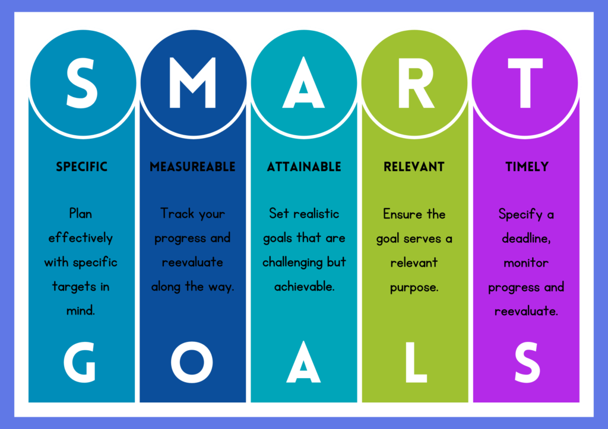

## SMARTE Ziele

### Auftrag
1. Analysieren Sie in den folgenden Aufgaben, ob das jeweilige Ziel SMART formuliert ist. Begründen Sie Ihre Antwort anhand aller fünf Kriterien. 
2. Erstellen Sie ein Verbesserungsvorschlag, falls das Ziel zu wenig SMART ist.

---

### **Aufgabe 1: IT-Projekt – Einführung einer neuen Software**

Ein Unternehmen möchte ein neues CRM-System einführen.

**Zielformulierung:**
„Wir wollen die Kundenzufriedenheit deutlich verbessern und das neue System möglichst schnell einführen.“

**Analyse:**

* **Spezifisch:** ❌ unklar („deutlich verbessern“, „möglichst schnell“)
* **Messbar:** ❌ keine Kennzahlen definiert
* **Attraktiv/Erreichbar:** ⚠️ grundsätzlich sinnvoll, aber nicht konkret überprüfbar
* **Realistisch:** ⚠️ nicht beurteilbar ohne genauere Angaben
* **Terminiert:** ❌ kein Zeitrahmen

**Fazit:**
Nicht SMART. Das Ziel ist zu vage formuliert.

**Verbesserungsvorschlag:**
„Das neue CRM-System wird bis zum 30.09. eingeführt, wodurch die Kundenzufriedenheit (gemessen durch Umfragen) innerhalb von 6 Monaten um 10 % steigt.“

---

### **Aufgabe 2: Bauprojekt – Renovation eines Bürogebäudes**

Ein Unternehmen plant die Modernisierung seiner Büroräume.

**Zielformulierung:**
„Die Renovation soll bis Ende November abgeschlossen sein und die Energiekosten um 15 % senken.“

**Analyse:**

* **Spezifisch:** ✔️ Renovation + Energiekostenreduktion klar definiert
* **Messbar:** ✔️ 15 % Reduktion
* **Attraktiv/Erreichbar:** ✔️ sinnvoll und typisch für Bauprojekte
* **Realistisch:** ⚠️ abhängig von Budget und Massnahmen (nicht vollständig beurteilbar)
* **Terminiert:** ✔️ Ende November

**Fazit:**
Grösstenteils SMART, mit kleiner Unsicherheit bei Realismus.

**Verbesserungsvorschlag:**
„Die Renovation wird bis zum 30.11. abgeschlossen und reduziert die Energiekosten im ersten Jahr nach Abschluss um 15 %.“

---

### **Aufgabe 3: Marketingprojekt – Social Media Kampagne**

Ein Start-up möchte seine Online-Präsenz steigern.

**Zielformulierung:**
„Wir wollen mehr Follower auf Instagram gewinnen und unsere Marke bekannter machen.“

**Analyse:**

* **Spezifisch:** ❌ „mehr Follower“ und „bekannter“ unklar
* **Messbar:** ❌ keine Zielwerte
* **Attraktiv/Erreichbar:** ✔️ grundsätzlich sinnvoll
* **Realistisch:** ⚠️ nicht beurteilbar
* **Terminiert:** ❌ fehlt

**Fazit:**
Nicht SMART.

**Verbesserungsvorschlag:**
„Die Anzahl Instagram-Follower wird innerhalb von 3 Monaten von 2’000 auf 3’000 erhöht und die Reichweite pro Beitrag um 20 % gesteigert.“

---

### **Aufgabe 4: Schulprojekt – Einführung eines neuen Lehrplans**

Eine Schule plant die Einführung eines neuen digitalen Lehrplans.

**Zielformulierung:**
„Der neue Lehrplan soll die Unterrichtsqualität verbessern und von den Lehrpersonen gut angenommen werden.“

**Analyse:**

* **Spezifisch:** ❌ unklar, was „Verbesserung“ bedeutet
* **Messbar:** ❌ keine Indikatoren definiert
* **Attraktiv/Erreichbar:** ✔️ grundsätzlich sinnvoll
* **Realistisch:** ⚠️ nicht messbar → schwer beurteilbar
* **Terminiert:** ❌ fehlt

**Fazit:**
Nicht SMART.

**Verbesserungsvorschlag:**
„Der neue Lehrplan wird bis zum Schuljahresbeginn eingeführt und erreicht innerhalb von 6 Monaten eine Zustimmung von mindestens 80 % der Lehrpersonen (gemessen durch Umfrage).“

---

### **Aufgabe 5: Logistikprojekt – Optimierung der Lieferzeiten**

Ein Logistikunternehmen möchte effizienter werden.

**Zielformulierung:**
„Die durchschnittliche Lieferzeit soll innerhalb von 6 Monaten von 5 Tagen auf 3 Tage reduziert werden.“

**Analyse:**

* **Spezifisch:** ✔️ klare Zieldefinition
* **Messbar:** ✔️ von 5 auf 3 Tage
* **Attraktiv/Erreichbar:** ✔️ sinnvoll
* **Realistisch:** ✔️ grundsätzlich plausibel (branchenabhängig)
* **Terminiert:** ✔️ innerhalb von 6 Monaten

**Fazit:**
SMART formuliert.

**Verbesserungsvorschlag (optional):**
„Die durchschnittliche Lieferzeit wird innerhalb von 6 Monaten von 5 auf 3 Tage reduziert.“

---

### **Aufgabe 6: HR-Projekt – Mitarbeiterzufriedenheit**

Ein Unternehmen möchte die Zufriedenheit seiner Mitarbeitenden erhöhen.

**Zielformulierung:**
„Die Mitarbeiterzufriedenheit soll verbessert werden, damit das Arbeitsklima besser wird.“

**Analyse:**

* **Spezifisch:** ❌ unklar formuliert
* **Messbar:** ❌ keine Kennzahlen
* **Attraktiv/Erreichbar:** ✔️ sinnvoll
* **Realistisch:** ⚠️ nicht überprüfbar
* **Terminiert:** ❌ fehlt

**Fazit:**
Nicht SMART.

**Verbesserungsvorschlag:**
„Die Mitarbeiterzufriedenheit wird innerhalb von 12 Monaten von 70 % auf 80 % gesteigert (gemessen durch jährliche Mitarbeiterbefragung).“
