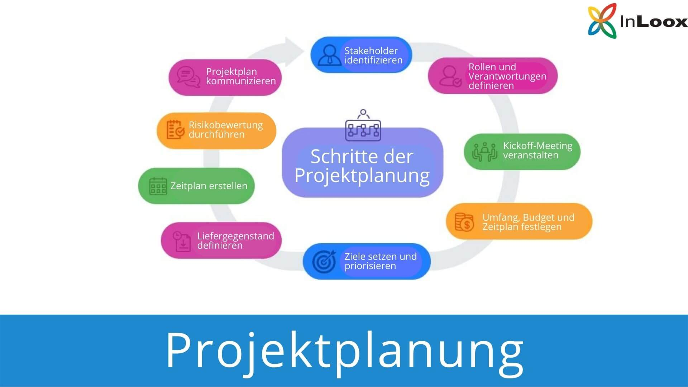

# Projekt-Planung mit Gantt-Chart

[]()

## **Aufgabe 1: Projekt planen**
Sie erhalten 75 Elemente (Tasks + Ressourcen) ungeordnet (flache Liste, keine Hierarchie, keine Abhängigkeiten, keine Ressourcen). Die Phasen sind ```Anforderungen, Design, Realisation, Testing, Abnahme```. 

11 Personen mit bewusst reduzierter Auslastung (sie arbeiten parallel in anderen Projekten): Peter Müller (PM), Anna Bauer (60%), Thomas Keller (50%), Sandra Huber (70%), Michael Schmid (60%), Felix Wagner (80%), Laura Fischer (70%), Jonas Weber (60%), Lena Hoffmann (50%), Klaus Richter (70%), Maria Schneider (60%).

Ihr Auftrag ist mit dem Tool https://www.onlinegantt.com/#/gantt die:
1. Öffnen des Files Aufgabe.gantt im Tool
2. Tasks den richtigen Phasen zuordnen und verschachteln
3. Abhängigkeiten (Finish-to-Start) definieren
4. Ressourcen zuweisen
5. Timeline ableiten: Projekt vom 06.04. bis 26.08.2026 mit:

| Phase         | Zeitraum | Tasks |
|---------------|----------------------|-------|
| Anforderungen | 06.04. – 01.05. | 13 (inkl. Meilenstein) |
| Design        | 04.05. – 22.05.| 12| 
| Realisation   | 25.05. – 06.07.| 22| 
| Testing       | 07.07. – 07.08.| 13| 
| Abnahme       | 10.08. – 26.08.| 10| 

