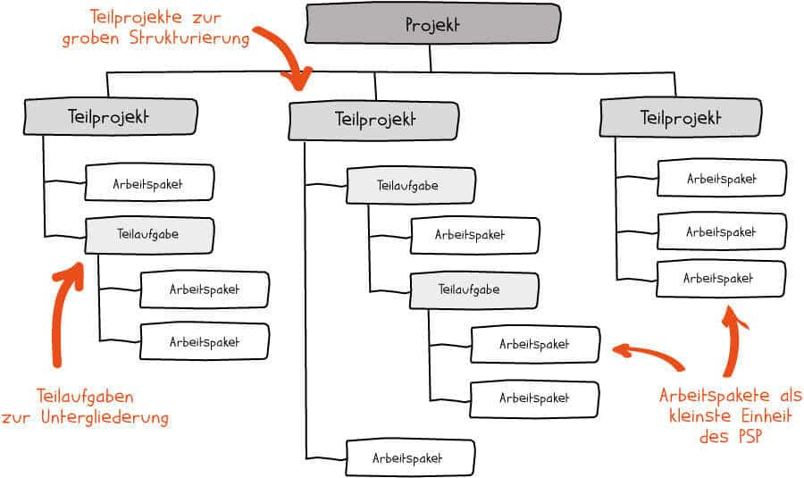

# Übungsaufgaben: Arbeitspakete

---

## Fallbeispiel 1 – **TechSolutions AG**

### Szenario

Die Softwarefirma **TechSolutions AG** startet ein neues Projekt (PL: Sandra Müller) zur Entwicklung eines internen HR-Self-Service-Portals. Der Projektstrukturplan (PSP) wurde bereits erstellt. Das Teilprojekt **«Benutzerverwaltung»** wurde als eigenständiger Bereich identifiziert und soll nun in konkrete Arbeitspakete aufgeteilt werden. Du bist der zuständige Teilprojektleiter.

Innerhalb des Kick-off-Workshops wurde festgestellt, dass das Arbeitspaket (2.1.1) **«Benutzerregistrierung implementieren»** eines der zentralen Elemente des Projektes ist. Es soll von Dir vollständig ausgeplant und von 2 Entwickler (zu je 40h) umgesetzt werden.

### Aufgabenstellung

**a)** Erkläre in eigenen Worten, was ein Arbeitspaket ist und warum es nach der Erstellung des PSP zwingend notwendig ist, Arbeitspakete detailliert zu definieren.

**b)** Ergänze die Lücken in der Vorlage zum Arbeitspaket **«Benutzerregistrierung implementieren»**.

| Feld | Inhalt                                                                                                                                |
|---|---------------------------------------------------------------------------------------------------------------------------------------|
| **Arbeitspaket** | ??                                                                                                                                    |
| **Projekt** | ??                                                                                                                                    | 
| **PSP-Code** | ??                                                                                                                                    |
| **Projektleiter** | ??                                                                                                                                    |
| **AP-Verantwortlich** | ??                                                                                                                                    |
| **Freigabe durch** | ??                                                                                                                                    |
| **Abnahme durch** | ??                                                                                                                                    |
| **Beschreibung** | ??                                                                                                                                    |
| **Ziele (SMART)** | ??                                                                                                                                    |
| **Einsatzmittel** | ??                                                                                                                                    |
| **Risiken** | Datenschutzanforderungen (DSGVO) nicht vollständig erfüllt; Abhängigkeit vom AP «Datenbankschema» (AP 2.1.0) noch nicht abgeschlossen |
| **Eingangsdokumente** | Anforderungsspezifikation HR-Portal, Datenbankschema (AP 2.1.0), UX-Prototyp (AP 1.3.2)                                               |
| **Ausgangsdokumente** | ??                                                                                                                                    |
| **Kosten (geschätzt)** | Personalkosten: ??; Infrastruktur: CHF 400.–; Gesamt: CHF ??                                                                          |

**c)** Im Team entsteht eine Diskussion: Der Entwickler meint, Personalkosten (CHF 120.–/h) sollten als «Fixkosten» aus dem Projekt herausgehalten werden. Die Projektleiterin besteht auf der vollständigen Einrechnung (Vollkostenansatz) als Stunden-/Tagessatz. Nimm Stellung zu beiden Positionen und begründe, welchen Ansatz Du empfiehlst.

---

### Musterlösung

#### a) Definition und Notwendigkeit von Arbeitspaketen *(6 Punkte)*

Ein **Arbeitspaket (AP)** ist die kleinstmögliche, selbständig planbare und kontrollierbare Einheit im Projektstrukturplan. Es konkretisiert die im PSP noch grob formulierten Teilpakete und legt fest, **was** zu tun ist, **wer** es tut, **bis wann** es erledigt sein muss und **welche Ressourcen** benötigt werden.

**Notwendigkeit:** Nach der Erstellung des PSP liegen lediglich Überschriften vor. Ohne die detaillierte Ausplanung in Arbeitspakete fehlen klare Verantwortlichkeiten, Abhängigkeiten zwischen Tätigkeiten sind unklar, und es gibt keine verlässliche Grundlage für das Projektcontrolling. Da zwischen APs in der Regel **Abhängigkeiten** bestehen (z. B. Datenbankschema muss vor der Implementierung vorliegen), ist eine präzise Definition unerlässlich für einen reibungslosen Projektverlauf.

---

#### b) Ausgefüllte Arbeitspaketvorlage

| Feld | Inhalt |
|---|---|
| **Arbeitspaket** | Benutzerregistrierung implementieren |
| **Projekt** | HR Self-Service Portal | 
| **PSP-Code** | 2.1.1 |
| **Projektleiter** | Sandra Müller |
| **AP-Verantwortlich** | Marco Bauer (Senior Developer) |
| **Freigabe durch** | Sandra Müller, Projektleitung |
| **Abnahme durch** | HR-Abteilungsleitung |
| **Beschreibung** | Entwicklung und Test eines Registrierungsmoduls für neue Mitarbeitende, inkl. Formularvalidierung, E-Mail-Verifizierung und Datenbankanbindung. |
| **Ziele (SMART)** | Bis zum 15.03.2025 ist ein vollständig funktionsfähiges Registrierungsmodul erstellt, das von mind. 95 % der Testnutzer in der internen UAT fehlerfrei durchlaufen wird. |
| **Einsatzmittel** | 2 Entwickler (je 40h), Testumgebung, Datenbankserver, Testnutzer (10 Personen aus HR) |
| **Risiken** | Datenschutzanforderungen (DSGVO) nicht vollständig erfüllt; Abhängigkeit vom AP «Datenbankschema» (AP 2.1.0) noch nicht abgeschlossen |
| **Eingangsdokumente** | Anforderungsspezifikation HR-Portal, Datenbankschema (AP 2.1.0), UX-Prototyp (AP 1.3.2) |
| **Ausgangsdokumente** | Quellcode (Repository), Testprotokoll, technische Dokumentation |
| **Kosten (geschätzt)** | Personalkosten: 80h × CHF 120.– = CHF 9'600.–; Infrastruktur: CHF 400.–; Gesamt: CHF 10'000.– |

---

#### c) Stellungnahme zur Behandlung von Personalkosten *(7 Punkte)*

**Position Entwickler («eh-da-Kosten»):** Personalkosten werden aus dem Projektbudget herausgehalten, da die Mitarbeitenden ohnehin angestellt sind und ihr Lohn unabhängig vom Projekt anfällt. Dies vereinfacht das Projektcontrolling erheblich und reduziert die Komplexität der Budgetüberwachung.

**Position Projektleiterin (Vollkostenansatz):** Personalkosten werden als Stunden- oder Tagessatz vollständig einberechnet. Nur so ist eine realistische **Make-or-Buy-Entscheidung** möglich (z. B. Eigenentwicklung vs. Softwarekauf). Ohne Personalkosten werden interne Lösungen systematisch zu günstig dargestellt.

**Empfehlung:** Für ein Projekt auf HF-Niveau ist der **Vollkostenansatz zu empfehlen**, insbesondere wenn Vergleiche mit externen Dienstleistern oder alternativen Lösungen notwendig sind. Die «eh-da-Kosten»-Methode verfälscht die Wirtschaftlichkeitsrechnung und sollte nur bei klar internen, nicht vergleichbaren Projekten in Betracht gezogen werden – und auch dann nur mit bewusster Entscheidung des Managements.

---

## Fallbeispiel 2 – **Kantonsschule Aarau**

### Szenario

Die **Kantonsschule Aarau** digitalisiert ihren Anmeldeprozess für neue Schülerinnen und Schüler. Der PSP umfasst u. a. folgende Teilprojekte: **(1) Online-Formular**, **(2) Datenbank**, **(3) Benachrichtigungssystem** und **(4) Testphase**. Im Kick-off-Workshop wurde deutlich, dass zwischen den einzelnen Arbeitspaketen starke Abhängigkeiten bestehen.

Das Projektteam diskutiert, ob die Abhängigkeiten nur auf AP-Ebene oder sogar bis auf Arbeitsschrittebene definiert werden sollen.

### Aufgabenstellung

**a)** Erkläre den Unterschied zwischen **Abhängigkeiten auf AP-Ebene** und **Abhängigkeiten auf Arbeitsschrittebene**. Nenne je ein konkretes Beispiel aus dem Schulprojekt.

**b)** Ergänze die Lücken des Arbeitspakets **«Datenbankschema erstellen»** (AP 2.1) mit den vorgegebenen **Arbeitsschritten** und sinnvollen **Vorbedingungen**:

**Arbeitsschritten**:
* Tabellen und Relationen definieren
* Technische Dokumentation erstellen
* Entitäten und Attribute modellieren (ER-Diagramm)
* Anforderungsanalyse durchführen (welche Daten werden benötigt?)
* Schema mit Projektleitung und Fachexperten reviewen
* Schema in Testdatenbank implementieren

AP 2.1 **«Datenbankschema erstellen»**

| Nr. | Arbeitsschritt | Vorbedingung | Verantwortliche/r | Kapazität |
|---|---|---|---|---|
| 2.1.1 | ?? | Anforderungsdokument vorhanden | Anna Roth (BA) | 4h |
| 2.1.2 | ?? | ?? abgeschlossen | Peter Keller (DBA) | 6h |
| 2.1.3 | ?? | ?? abgeschlossen | Peter Keller (DBA) | 4h |
| 2.1.4 | ?? | ?? abgeschlossen | Anna Roth (BA) | 2h |
| 2.1.5 | ?? | ?? abgeschlossen | Peter Keller (DBA) | 3h |
| 2.1.6 | ?? | ?? abgeschlossen | Anna Roth (BA) | 2h |

**c)** Die Teamleitung möchte alle Abhängigkeiten bis auf Arbeitsschrittebene definieren. Ein Teammitglied warnt, dies sei kontraproduktiv. Vervollständige die Tabelle unten anhand
folgender Stichworte:

* Wartezeiten: ein AP muss ganz abgeschlossen sein, obwohl nur ein Teilschritt relevant wäre
* Einfacher zu verwalten, geringere Komplexität
* Kleinere/mittlere Projekte, wenig PM-Ressourcen
* Grossprojekte mit engen Timelines und ausreichend PM-Erfahrung
* Frühere Starts möglich → Zeitersparnis im Gesamtprojekt
* Hohe Komplexität: praktisch nur mit PM-Software (z. B. MS Project) beherrschbar

| Aspekt | Abhängigkeiten auf AP-Ebene      | Abhängigkeiten auf Arbeitsschrittebene |
|---|---------|-------------------|
| **Vorteil** | ??  | ?? |
| **Nachteil** | ??  | ?? |
| **Einsatz** | ??  | ?? |

---

### Musterlösung

#### a) Unterschied der Abhängigkeitsebenen

**Abhängigkeit auf AP-Ebene:** Ein ganzes Arbeitspaket muss vollständig abgeschlossen sein, bevor ein anderes beginnen kann.

- *Beispiel:* AP 2.1 «Datenbankschema erstellen» muss abgeschlossen sein, bevor AP 1.1 «Online-Formular implementieren» beginnen kann, da das Formular die Datenbankstruktur kennen muss.

**Abhängigkeit auf Arbeitsschrittebene:** Nicht das gesamte AP, sondern nur ein bestimmter Schritt innerhalb eines APs muss erledigt sein, damit ein anderes AP (oder ein Schritt darin) starten kann.

- *Beispiel:* Schritt 2.1.3 «Tabelle ‹Anmeldungen› definieren» muss erledigt sein, damit mit Schritt 1.1.2 «Formularfelder programmieren» begonnen werden kann – unabhängig davon, ob AP 2.1 insgesamt abgeschlossen ist.

---

#### b) Arbeitsschritte für AP «Datenbankschema erstellen»

| Nr. | Arbeitsschritt | Vorbedingung | Verantwortliche/r | Kapazität |
|---|---|---|---|---|
| 2.1.1 | Anforderungsanalyse durchführen (welche Daten werden benötigt?) | Anforderungsdokument vorhanden | Anna Roth (BA) | 4h |
| 2.1.2 | Entitäten und Attribute modellieren (ER-Diagramm) | 2.1.1 abgeschlossen | Peter Keller (DBA) | 6h |
| 2.1.3 | Tabellen und Relationen definieren | 2.1.2 abgeschlossen | Peter Keller (DBA) | 4h |
| 2.1.4 | Schema mit Projektleitung und Fachexperten reviewen | 2.1.3 abgeschlossen | Anna Roth (BA) | 2h |
| 2.1.5 | Schema in Testdatenbank implementieren | 2.1.4 abgeschlossen | Peter Keller (DBA) | 3h |
| 2.1.6 | Technische Dokumentation erstellen | 2.1.5 abgeschlossen | Anna Roth (BA) | 2h |

**Gesamtkapazität:** ca. 21 Personenstunden

---

#### c) Beurteilung beider Standpunkte

| Aspekt | Abhängigkeiten auf AP-Ebene | Abhängigkeiten auf Arbeitsschrittebene |
|---|---|---|
| **Vorteil** | Einfacher zu verwalten, geringere Komplexität | Frühere Starts möglich → Zeitersparnis im Gesamtprojekt |
| **Nachteil** | Wartezeiten: ein AP muss ganz abgeschlossen sein, obwohl nur ein Teilschritt relevant wäre | Hohe Komplexität; praktisch nur mit PM-Software (z. B. MS Project) beherrschbar |
| **Einsatz** | Kleinere/mittlere Projekte, wenig PM-Ressourcen | Grossprojekte mit engen Timelines und ausreichend PM-Erfahrung |

**Fazit:** Für das Schulprojekt mit einem kleinen Team empfiehlt sich zunächst die AP-Ebene. Eine Verfeinerung auf Arbeitsschrittebene lohnt sich nur dann, wenn kritische Pfade identifiziert wurden und die nötige PM-Software sowie Erfahrung vorhanden sind. Blindes Verfeinern erhöht die Komplexität ohne proportionalen Mehrwert.

---

## Fallbeispiel 3 - **SwissFreight GmbH**

### Szenario

Das mittelgrosse Logistikunternehmen **SwissFreight GmbH** führt ein ERP-Einführungsprojekt durch. Nach dem Kick-off-Workshop sind die Arbeitspakete formal definiert und von Projektleitung sowie AP-Verantwortlichen unterschrieben worden.

Drei Monate nach Projektstart zeigt sich: Mehrere APs sind in Verzug, Verantwortlichkeiten werden untereinander verschoben, und das Budget ist bereits zu 70 % aufgebraucht, obwohl erst 40 % des Projekts abgeschlossen sind. Eine Analyse ergibt, dass die Arbeitspaketfeinplanung zu Beginn nur oberflächlich durchgeführt wurde.

### Aufgabenstellung

**a)** Vervollständige die Tabelle unten anhand folgender **Fehler bei der Arbeitspaketfeinplanung** und deren Auswirkungen: 

* SMART-Kriterien nicht angewendet
* Fehlende oder unklare Verantwortlichkeiten
* Niemand fühlt sich zuständig; Aufgaben werden zwischen Teammitgliedern verschoben, ohne dass jemand Gesamtverantwortung trägt. 
* Zu grobe Kostenschätzungen ohne Arbeitsschrittplanung
* Typisches «Wir wollen endlich anfangen»-Phänomen: Kleinen «Unklarheiten» summieren sich zu grossen Problemen im Verlauf.
* Abhängigkeiten nicht oder falsch dokumentiert
* APs starten zu spät oder müssen unterbrochen werden, weil Vorbedingungen nicht erfüllt sind – klassische Ursache für Terminverzug.
* AP-Ziele sind vage, wodurch die Abnahme erschwert wird und kein klares Fertigstellungskriterium existiert.
* Zu wenig Zeit für Feinplanung eingeplant
* Budgetabweichungen werden zu spät erkannt, da keine Grundlage für Soll-Ist-Vergleiche vorhanden ist.

| Fehler   | Auswirkung  |
|----------|-------------|
| ??       | ??          |

**b)** Erkläre die **Rolle der Projektleitung** und der **AP-Verantwortlichen** im Rahmen der Feinplanung und des laufenden Controllings. Welche Massnahmen hätten die Probleme bei SwissFreight verhindern können?

**c)** Das Management fragt, ob im verbleibenden Projektteil nun jedes noch so kleine Detail geplant werden soll, um ähnliche Probleme zu vermeiden. Beziehe Stellung: Wo liegt das richtige Mass an Planung?

---

### Musterlösung

#### a) Typische Fehler bei der AP-Feinplanung

| Fehler | Auswirkung |
|---|---|
| **1. Fehlende oder unklare Verantwortlichkeiten** | Niemand fühlt sich zuständig; Aufgaben werden zwischen Teammitgliedern verschoben, ohne dass jemand Gesamtverantwortung trägt. |
| **2. Zu grobe Kostenschätzungen ohne Arbeitsschrittplanung** | Budgetabweichungen werden zu spät erkannt, da keine Grundlage für Soll-Ist-Vergleiche vorhanden ist. |
| **3. Abhängigkeiten nicht oder falsch dokumentiert** | APs starten zu spät oder müssen unterbrochen werden, weil Vorbedingungen nicht erfüllt sind – klassische Ursache für Terminverzug. |
| **4. SMART-Kriterien nicht angewendet** | AP-Ziele sind vage, wodurch die Abnahme erschwert wird und kein klares Fertigstellungskriterium existiert. |
| **5. Zu wenig Zeit für Feinplanung eingeplant** | Typisches «Wir wollen endlich anfangen»-Phänomen: Kleinen «Unklarheiten» summieren sich zu grossen Problemen im Verlauf. |

---

#### b) Rollen und Gegenmassnahmen

**Projektleitung:**
- Stellt sicher, dass alle AP-Verantwortlichen die nötigen Informationen für die Feinplanung erhalten.
- Koordiniert die abschliessende Diskussion und Freigabe der APs in der Projektteamsitzung.
- Überwacht im laufenden Betrieb, ob Planabweichungen frühzeitig gemeldet werden.

**AP-Verantwortliche:**
- Sind die «Kümmerer» ihres APs: Sie stossen notwendige Aktivitäten an und identifizieren Planabweichungen rechtzeitig.
- Tragen die personifizierte Verantwortung für Einhaltung von Zeit, Budget und Qualität ihres APs.

**Präventive Massnahmen für SwissFreight:**
- Kick-off-Workshop mit ausreichend Zeit zur gemeinsamen AP-Feinplanung (mind. 5–10 Tage Nachbearbeitungszeit).
- Verwendung einer einheitlichen Arbeitspaketvorlage (inkl. SMART-Ziele, Budget, Meilensteine).
- Regelmässige Projektteamsitzungen mit standardisiertem Statusreporting pro AP.
- Frühwarnsystem: Sobald ein AP 10 % Budgetabweichung oder Terminverzug zeigt, wird die Projektleitung informiert.

---

#### c) Das richtige Mass an Planung

Weder zu wenig noch zu viel Planung ist zielführend. Die AP-Feinplanung ist eine **Investition**, die sich auszahlt – aber nur bis zu einem bestimmten Grad.

**Zu wenig Planung** (wie bei SwissFreight): Unklare Verantwortlichkeiten, fehlende Controlling-Basis, Überraschungen im Projektverlauf.

**Zu viel Planung:** Alle potenziellen Risiken und Eventualitäten antizipieren zu wollen, sprengt den Rahmen einer sinnvollen Projektplanung. Der Aufwand für die Planung übersteigt den Nutzen; das Team verliert Motivation und Flexibilität.

**Das richtige Mass** ergibt sich aus:
- **Projektkomplexität:** Je grösser und riskanter das Projekt, desto detaillierter sollte geplant werden.
- **Erfahrung des Teams:** Unerfahrene Teams brauchen detailliertere AP-Vorgaben; erfahrene Teams können mit mehr Eigenverantwortung arbeiten.
- **Pragmatismus:** Planung sollte eine solide Grundlage schaffen, ohne die Handlungsfähigkeit einzuschränken. Die Faustregel lautet: Plane so detailliert wie nötig, so flexibel wie möglich.

Für SwissFreight bedeutet das: Die verbleibenden APs sollten mit SMART-Zielen, klaren Verantwortlichkeiten und realistischen Budgets versehen werden – ohne jede theoretisch mögliche Komplikation vorwegzunehmen.

